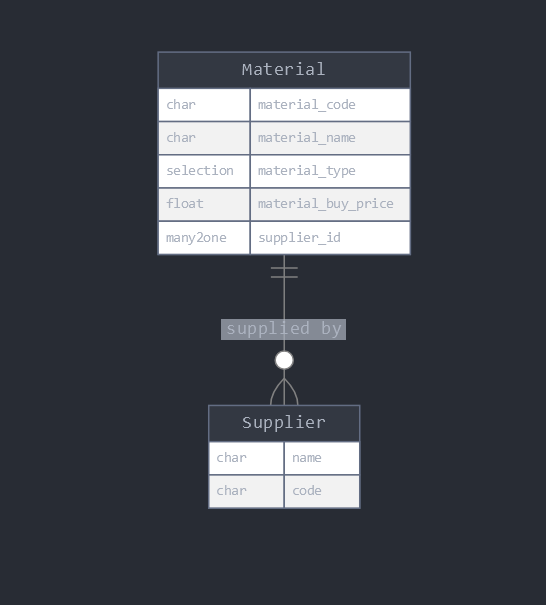

# Material Management Module for Odoo 14



## Features
- Material registration with fields:
  - Material Code
  - Material Name
  - Material Type (Fabric, Jeans, Cotton)
  - Material Buy Price (>= 100)
  - Related Supplier
- CRUD operations for materials via REST API.

## Installation
1. Clone the repository into your Odoo addons directory:
   ```bash
   git clone https://github.com/your-username/material_management.git
